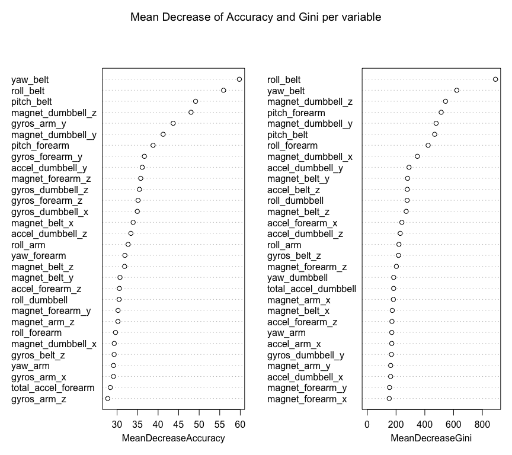

# Predictive Modeling on Human Activity Recognition of Weight Lifting Exercise
        


### Executive summary
A large amount of human acitivity data has been collected by wearable devices.  One thing that people regularly take these measurements is to quantify how much of a particular activity they do, but they rarely quantify how well they do it.  So this report is going to explore how to predict activity quality from activity monitors, using the weight-lifting exercise dataset coming from the Qualitative Activity Recognition of Weight Lifting Exercise analysis.

In this weight-lifting exercise experiment, participants were asked to perform one set of 10 repetitions of the same Unilateral Dumbbell Bisceps Curl exercise correctly (Class A) and other 4 common incorrect ways (Class B through E):

* Class A: exactly according to the specification
* Class B: throwing the elbows to the front
* Class C: lifting the dumbbell only halfway
* Class D: lowering the dumbbell only halfway
* Class E: throwing the hips to the front

The sensors, which were mounted on participants' glove, armband, lumbar belt and dumbbell, recorded the data such as Euler anlges (roll, pitch and yaw), raw accelermoeter, gyroscope and magnetometer readings.

More information is available from the website here: <http://groupware.les.inf.puc-rio.br/har> (see the section on the Weight Lifting Exercise Dataset).

Using this weight-lifting exercise dataset, the goal of this report is to employ machine leaning algorithm to build a predictive model that will attempt to classify the manner (or class) in which they did the exercise.  It turns out that random forest algorithm predicts very well on the provided test data.

---

### Loading in the datasets


```r
# read in the traing set and test set
data <- read.csv("~/Documents/R/pml-training.csv", header=TRUE, na.strings=c("NA","#DIV/0!",""))
test <- read.csv("~/Documents/R/pml-testing.csv", header=TRUE, na.strings=c("NA","#DIV/0!",""))

# get a sense of how datasets look like
summary(data)
summary(test)
dim(data)
dim(test)

# analyze the class of variables in the dataset
table(sapply(data,class))
table(sapply(test,class))
```

There were two datasets in CSV format, one to be used for training, and another one for testing.

* A training set made up of 19,622 observations of 160 variables. Each observation is a single repetition of the given exercise.
* A test set made up of 20 observations that will be used as a final evaluation for the predictive model

---

### Cleaning and preparing the data

In this section, we will inspect, clean and prepare the data for further processing.

1. reformat all measurement columns into numerics


```r
for (i in 8:159) {
        data[,i] <- as.numeric(data[,i])
        test[,i] <- as.numeric(test[,i])
}
```

2. remove unnecessary columns

The first seven columns of the training dataset (X, user_name, raw_timestamp_part_1, raw_timestamp_part_2, cvtd_timestamp, new_window, num_window) are not related to the sensor measurements, but rather to the identity of the person, and the time stamps and capture windows for the sensor data.  According to the description of weight-lifting exercise experiment, participants were supervised by an experienced wieght lifter to make sure the execution complied to the manner that they are supposed to simulate, so those seven columns are not determining features to the predictive model and can be removed.


```r
data <- data[,-(1:7)]
```

3. identify variables that are overwhelmingly missing values (NA) and these too are to be removed


```r
# select columns that don't have NAs
indexNA <- as.vector( sapply(data, function(x) {length(which(is.na(x)))!=0}))
data <- data[,!indexNA]
```

As far 52 measurements of the x, y, and z axis components of the acceleration, gyroscope, and magnetometer sensors, as well as the overall acceleration, pitch, roll and yaw, are retained as the predictor candidates.

---

### Creating a cross validation set

Next the original training set is futher split into two parts: 70% of the observations will be used to train the model and the remaining 30% will serve as probe set. The original test set will be reserved until final testing.


```r
# subset the original training set into training/probe sets for cross validation
suppressPackageStartupMessages(library(caret))
set.seed(6882)
indexTrain <- createDataPartition(data$classe, p=0.7, list=FALSE)
training <- data[indexTrain, ]        # 70%
probe <- data[-indexTrain, ]          # 30%
```

---

### Building predictive model

Before training the model, let's check if any near zero variance predictors.


```r
# select columns that don't have NAs
nearZeroVar(data, , saveMetrics=TRUE)
```

There are no numeric variables with near zero variance, so no more variables can be reduced this way and the remaining 52 predictor candidates continue to be used in the model building.

Since random forests are usually one of the two top performing algorithms along with boosting in prediction contest, let's start with random forests. Firstly set a seed to make this report reproducable.


```r
# set seed for reproducibility
set.seed(68)

# Model 1: RandomForest
suppressPackageStartupMessages(library(randomForest))
modFit_rf <-randomForest(classe ~., data=training, importance=TRUE)
print(modFit_rf)
```

```
## 
## Call:
##  randomForest(formula = classe ~ ., data = training, importance = TRUE) 
##                Type of random forest: classification
##                      Number of trees: 500
## No. of variables tried at each split: 7
## 
##         OOB estimate of  error rate: 0.52%
## Confusion matrix:
##      A    B    C    D    E class.error
## A 3901    4    0    0    1 0.001280082
## B   13 2642    3    0    0 0.006019564
## C    0   15 2376    5    0 0.008347245
## D    0    0   22 2228    2 0.010657194
## E    0    0    0    7 2518 0.002772277
```

The expected OOB estimate of error rate is 0.52% and the breakdown by class are as shown above.  It can be seen that the initial error estimates are quite good. Random forests are often very accurate but difficult to interpret (see the first 30 predictors, ordered by their mean decrease in accuracy and Gini, in below figure).


```r
suppressPackageStartupMessages(library(randomForest))
# plot the accuracy and Gini
varImpPlot(modFit_rf, main="Mean Decrease of Accuracy and Gini per variable")
```



This plot indicates that the measurements of the belt sensor (roll, yaw, and pitch), the forearm (pitch) and the dumbbell (magnetic component), are the most important for distinguishing whether this particular exercise is being done correctly or not. This makes sense as the way the core body moves and the rotation of the forearm, are closely related to a correct execution of the biceps curl, and in the case of the metallic dumbbell the position changes are readily detected by the magnetometer.

---

### Cross-validating the model with probe set

Now apply the random forests model to the probe set to gain a better understanding of how accurate the random forests model really is.


```r
cm_rf_probe <- confusionMatrix(probe$classe, predict(modFit_rf, newdata=probe))
cm_rf_probe$table
```

```
##           Reference
## Prediction    A    B    C    D    E
##          A 1674    0    0    0    0
##          B    8 1130    1    0    0
##          C    0    1 1023    2    0
##          D    0    0    9  954    1
##          E    0    0    3    0 1079
```

```r
cm_rf_probe$overall
```

```
##       Accuracy          Kappa  AccuracyLower  AccuracyUpper   AccuracyNull 
##      0.9957519      0.9946258      0.9937353      0.9972490      0.2858114 
## AccuracyPValue  McnemarPValue 
##      0.0000000            NaN
```

Cross-validating the model results in an estimated error of 0.42 % and the 95% confidence interval: [0.9937, 0.9972]. The validation results also in a high kappa statistic of 0.9946, which suggest a very good classifier.


```r
cm_rf_probe$byClass
```

```
##          Sensitivity Specificity Pos Pred Value Neg Pred Value Prevalence
## Class: A   0.9952438   1.0000000      1.0000000      0.9981002  0.2858114
## Class: B   0.9991158   0.9981069      0.9920983      0.9997893  0.1921835
## Class: C   0.9874517   0.9993813      0.9970760      0.9973246  0.1760408
## Class: D   0.9979079   0.9979712      0.9896266      0.9995936  0.1624469
## Class: E   0.9990741   0.9993757      0.9972274      0.9997918  0.1835174
##          Detection Rate Detection Prevalence Balanced Accuracy
## Class: A      0.2844520            0.2844520         0.9976219
## Class: B      0.1920136            0.1935429         0.9986113
## Class: C      0.1738318            0.1743415         0.9934165
## Class: D      0.1621071            0.1638063         0.9979396
## Class: E      0.1833475            0.1838573         0.9992249
```

        
The random forest model is quite good - it achieves an accuracy more than 99%.

---

### Final evaluation with test set

Finally the random forest model is further applied to the test sets and then to create the files for programming submission.


```r
# select the required variables only just like training/probe sets
test <- test[, names(test) %in% names(data)]
answer <- predict(modFit_rf, test)
answer <- as.character(answer)
```

---

### Submission to Coursea


```r
# code as suggested by Coursera to create 20 text files with a single capital letter (A, B, C, D, or E).  Each text file corresponding to the prediction for the corresponding problem in the test data set.

pml_write_files = function(x){
        n = length(x)
        path <- "~/Documents/R"
        for(i in 1:n){
                filename = paste0("problem_id_",i,".txt")
                write.table(x[i], file=file.path(path, filename), 
                quote=FALSE, row.names=FALSE, col.names=FALSE)
        }
}
pml_write_files(answer)
```


